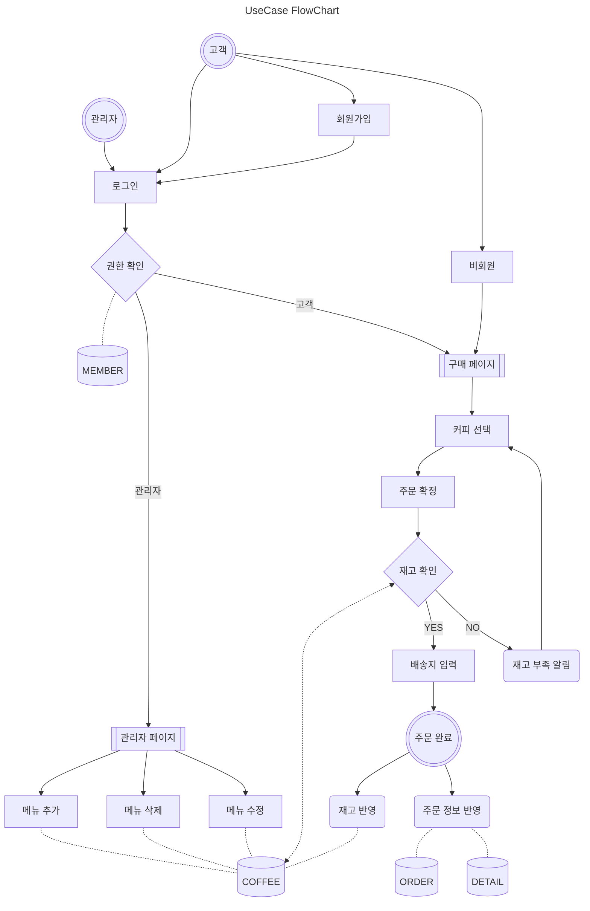

# 데브코스 1차과제 "카페 메뉴 관리 서비스 제작"
## 팀 소개 : 파이브 가이즈
- 팀원 : 최대열, 강민서, 정성원

---
## 구조도
- 저희 팀은 아래의 다이어그램을 기준으로 프로젝트를 진행하였습니다. 

```mermaid
---
title: UseCase FlowChart
---
flowchart TD
	Admin(((관리자))) --> sign_up[로그인]
	Client(((고객))) --> sign_up
	Client --> sign_in[회원가입] --> sign_up
	
	sign_up --> is_role{권한 확인}
  is_role -.- MEMBER[(MEMBER)]
	is_role --> |관리자| admin_page[[관리자 페이지]]
	is_role --> |고객| shop_page[[구매 페이지]]
	Client --> non_member[비회원] --> shop_page
  
  admin_page --> insert_menu[메뉴 추가] -.- COFFEE[(COFFEE)]
  admin_page --> delete_menu[메뉴 삭제] -.- COFFEE
  admin_page --> update_menu[메뉴 수정] -.- COFFEE
  
  shop_page --> select_coffee[커피 선택]
  select_coffee --> confirm[주문 확정]
  confirm --> is_stock{재고 확인} <-.-> COFFEE
  is_stock --> |YES|delivery_form[배송지 입력] --> complete_order(((주문 완료)))
  is_stock --> |NO| alert(재고 부족 알림)
  alert --> select_coffee
    
  complete_order --> update_COFFEE(재고 반영) -.- COFFEE
  complete_order --> update_ORDER(주문 정보 반영)
  update_ORDER -.- ORDER[(ORDER)]
  update_ORDER -.- DETAILED_ORDER[(DETAIL)]
```
